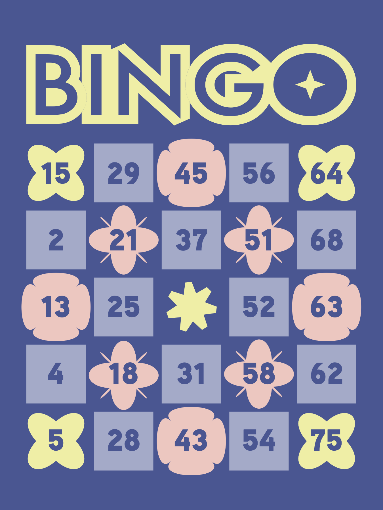
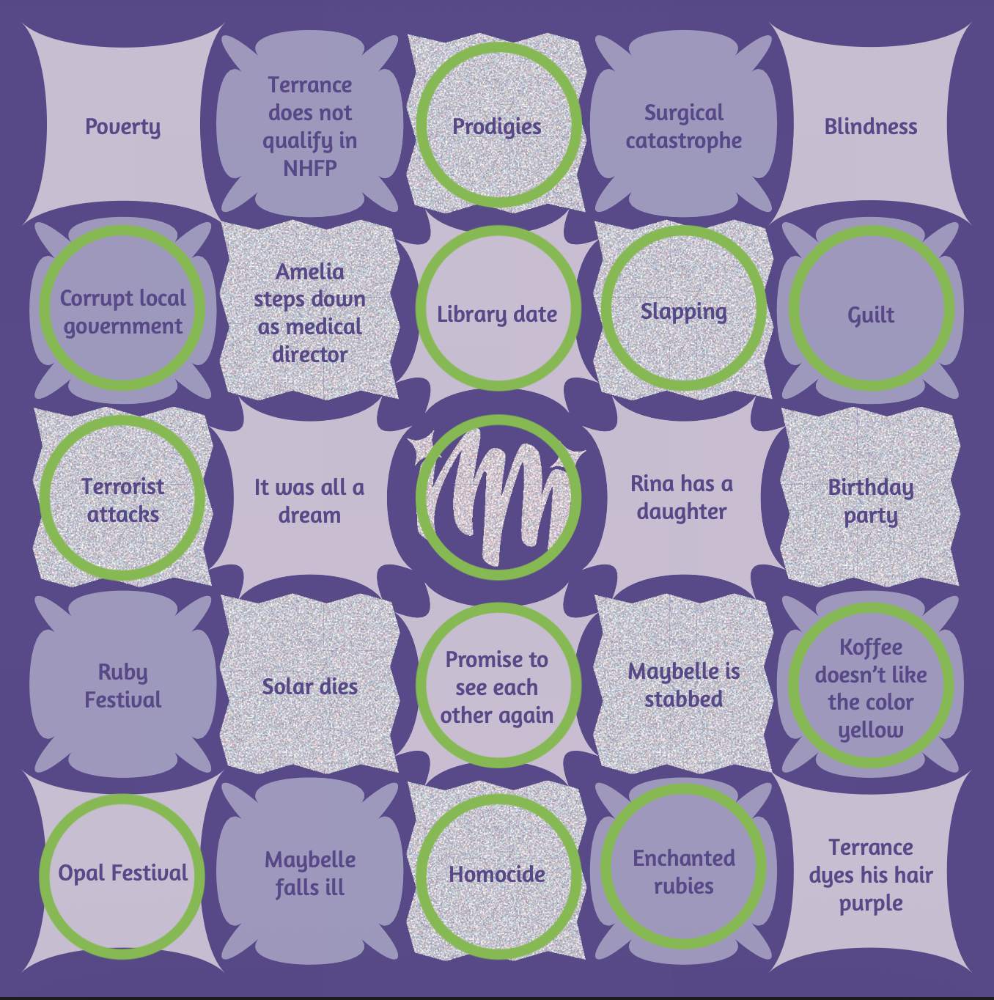

# Automated Bingo Card Generation

Generate as many unique, playable Bingo cards as you want. The Python scripts here build randomized 5 × 5 cards and write every card's values to a CSV file (one card per row, "wide" format). Pair that CSV with a card design, map the values onto the squares (for example with Adobe InDesign's Data Merge), and you have a full printable set.

<p align="center">
  
  &nbsp;&nbsp;
  
</p>

There are two versions:

| | **Basic 75-Ball Bingo** (`bingo_75.py`) | **True/False Statement Bingo** (`bingo_MM.py`) |
|---|---|---|
| Grid | 5 × 5, `FREE` center | 5 × 5, `FREE` center |
| Square contents | Numbers: `B` 1–15, `I` 16–30, `N` 31–45, `G` 46–60, `O` 61–75 | TRUE/FALSE statements you write yourself |
| Uniqueness | Every card is random and unique | Every card is random and unique |
| Winners | Left to chance | You choose exactly how many cards win and how many lose |
| Output | `bingo_card_values.csv` | `your_set.csv` |

75-ball Bingo is the most popular version of Bingo in the United States. The True/False version came from a book-marketing idea, described [below](#the-idea-behind-truefalse-bingo).

---

## Repository layout

```
Bingo/
├── bingo_75.py                         # 75-ball number card generator
├── bingo_MM.py                         # True/False statement card generator
├── requirements.txt
├── templates/
│   ├── Bingo Card - T_F Bank.csv       # Statement bank to fill in (used by bingo_MM.py)
│   ├── MM-Bingo-Card-Design.png        # Blank card design for the True/False set
│   └── Sugar-Set-Card-Designs.pdf      # 4 blank colorways for 75-ball cards
├── examples/
│   ├── 75-cards.csv                    # Sample output from bingo_75.py (100 cards)
│   ├── MM-cards.csv                    # Sample output from bingo_MM.py (25 cards)
│   ├── 75-Filled-Card.png              # A finished 75-ball card
│   └── MM-Filled-Card.png              # A finished True/False card (winner)
└── docs/
    └── Bingo-Project-Presentation.pdf  # Project slides
```

---

## Quick start

**Requirements:** Python 3 and [pandas](https://pandas.pydata.org/). `random` is part of the standard library.

```bash
git clone https://github.com/KaylenTon/Bingo.git
cd Bingo
pip install -r requirements.txt
```

Run both scripts from the root of the repository. `bingo_MM.py` looks for its statement bank at `templates/Bingo Card - T_F Bank.csv`.

### 1. Basic 75-Ball Bingo

```bash
python bingo_75.py
```

This writes `bingo_card_values.csv`. To change how many cards you get, edit this line in [bingo_75.py](bingo_75.py):

```python
cards = create_bingo_card(100)   # number of cards to generate
```

### 2. True/False Statement Bingo

1. Open [templates/Bingo Card - T_F Bank.csv](templates/Bingo%20Card%20-%20T_F%20Bank.csv) in Excel or Google Sheets.
2. Starting at row 2, put true statements in column A (`TRUE`) and false statements in column B (`FALSE`).
   * You need **at least 11 true and 20 false statements**, because a single card can draw that many of each. A bigger bank gives more varied cards.
3. Save the file as a `.csv` in the same place with the same name.
4. Set how many winning and losing cards you want at the bottom of [bingo_MM.py](bingo_MM.py):

   ```python
   your_set = create_set(3, 7)   # 3 winning cards + 7 losing cards = 10 cards
   ```

5. Run it:

   ```bash
   python bingo_MM.py
   ```

   This writes `your_set.csv`.

### 3. Turn the CSV into cards

1. Pick a design. You can use one from [templates/](templates/) or make your own.
2. Map the CSV columns onto the squares. Each row is one card. Columns `B1`–`B5` fill the **B** column from top to bottom, `I1`–`I5` fill the **I** column, and so on. `N3` is always `FREE`.
3. Replicate the design for every row and export.

I used **Adobe InDesign's Data Merge** for this step. Any mail-merge tool that reads CSV files will work too.

---

## How the code works

### `bingo_75.py`

| Function | What it does |
|---|---|
| `create_bingo_card(count=1)` | Builds `count` unique cards. For each card it takes 5 random numbers from each column's range with `random.sample`, so no number repeats on a card. It sets the center square to `"FREE"` and throws out duplicate cards. Returns a list of 25-value cards. |

The script then loads the cards into a pandas DataFrame, names the columns `B1`…`O5`, prints how many duplicate cards there are (always `0`), and saves the CSV.

### `bingo_MM.py`

The script reads the TRUE and FALSE statements from the statement bank into two lists: `truth_statements` and `false_statements`. It also defines `winning_patterns`, the 12 ways to win: 5 rows, 5 columns and 2 diagonals. These are stored as square positions 0–24, with 12 as the center.

| Function | What it does |
|---|---|
| `count_winning_patterns(card)` | Counts how many winning patterns on a card are completely true. `FREE` counts as true. This check is what guarantees that losing cards really lose. |
| `create_winning_stack(total_winning_cards)` | For each winning card, it picks a random winning pattern, fills that line with true statements and fills the rest with false ones. Then it scatters 3–6 more true statements so the winning line is harder to spot. Rows are labeled `WINNER`. |
| `create_losing_stack(total_losing_cards)` | Places 5–10 true statements at random and fills the rest with false ones. A card is kept only if it is unique **and** `count_winning_patterns(card) == 0`. Rows are labeled `LOSER`. |
| `create_set(total_winning_cards=1, total_losing_cards=10)` | **The main function.** It builds both stacks, combines them and adds a shuffled `card_id`, so the ID doesn't reveal which cards win. Returns the full set as a DataFrame. |

**Skills demonstrated:** conditionals, loops, lists, randomization, functions, algorithm design, data validation, file I/O and automation.

---

## Resources

### Templates

| File | Use it for |
|---|---|
| [`templates/Bingo Card - T_F Bank.csv`](templates/Bingo%20Card%20-%20T_F%20Bank.csv) | The statement bank that `bingo_MM.py` reads. Fill it in before you run the script. |
| [`templates/MM-Bingo-Card-Design.png`](templates/MM-Bingo-Card-Design.png) | A blank card design for the True/False set. |
| [`templates/Sugar-Set-Card-Designs.pdf`](templates/Sugar-Set-Card-Designs.pdf) | The "Sugar Set": 4 blank 75-ball card designs in different colorways. |

<p align="center">
  
</p>

All designs were made in Adobe Illustrator. As for design strategy, there isn't one. Fun shapes and poppy colors are just my vibe :)

### Sample output data

| File | Contents |
|---|---|
| [`examples/75-cards.csv`](examples/75-cards.csv) | 100 cards from `bingo_75.py` |
| [`examples/MM-cards.csv`](examples/MM-cards.csv) | 25 cards from `bingo_MM.py`, with `card_id` and `Winner?` columns |

---

## Output results

### CSV output

**`bingo_75.py`:** one card per row.

```
B1,B2,B3,B4,B5,I1,I2,I3,I4,I5,N1,N2,N3,N4,N5,G1,G2,G3,G4,G5,O1,O2,O3,O4,O5
1,5,15,14,2,28,29,26,20,27,38,41,FREE,39,42,60,48,57,53,58,75,67,74,61,69
4,1,7,15,10,21,29,18,17,30,40,43,FREE,32,34,59,51,52,55,57,71,65,72,62,75
```

**`bingo_MM.py`:** one card per row, plus a shuffled ID and a winner flag.

```
card_id,Winner?,B1,B2,B3,B4,B5,I1,...,N3,...,O5
13,WINNER,Poverty,Corrupt local government,Terrorist attacks,Ruby Festival,Opal Festival,...,FREE,...,Terrance dyes his hair purple
```

### Finished cards

| 75-Ball Bingo | True/False Bingo: Card #13, a **WINNER** |
|---|---|
|  |  |
| Values mapped onto the first Sugar Set design. | Row 13 of `examples/MM-cards.csv` mapped onto the MM design. The circles mark the true statements. The whole **N** column is true, so this card wins. |

---

## The idea behind True/False Bingo

Picture an author promoting a book that won't come out for years. As part of a pre-order or promo campaign, each reader gets a unique Bingo card. Every square holds a statement that will turn out to be true or false once the book is released. Readers won't know the answers until then, which builds anticipation and gets them guessing about what will become canon.

Because `bingo_MM.py` decides exactly how many cards win, the author can plan prizes ahead of time, like tickets to a related event, exclusive merch or a special edition of the book.

---

## Tools

| Tool | Used for |
|---|---|
| **Excel** | Building the true/false statement bank |
| **Python** (pandas, random) | Generating the randomized 5 × 5 cards |
| **Adobe Illustrator** | Designing the cards to match the novel's theme |
| **Adobe InDesign** | Filling every card's squares with Data Merge |

See [docs/Bingo-Project-Presentation.pdf](docs/Bingo-Project-Presentation.pdf) for the full project presentation.

---

*Made by Kaylen Ton*
